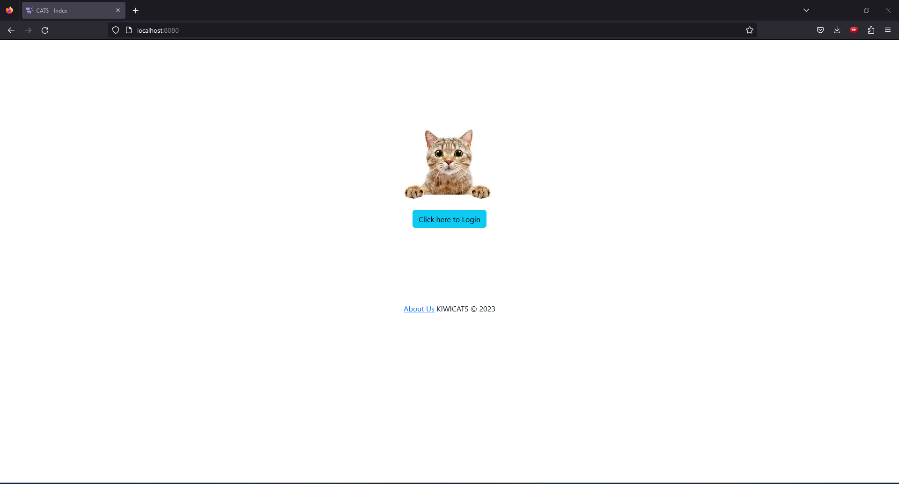
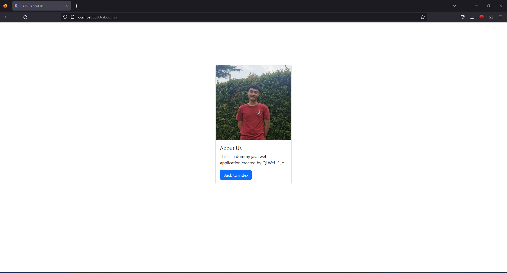
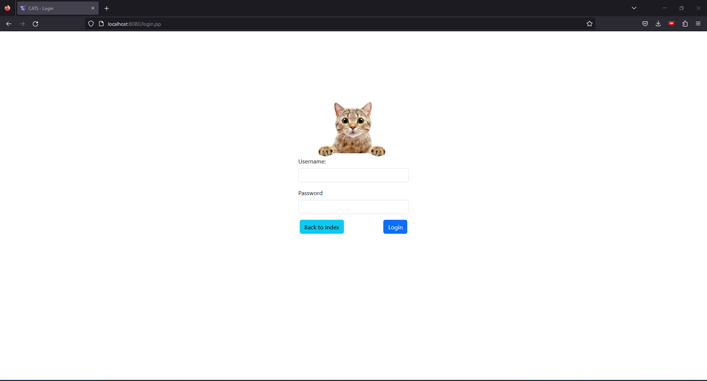
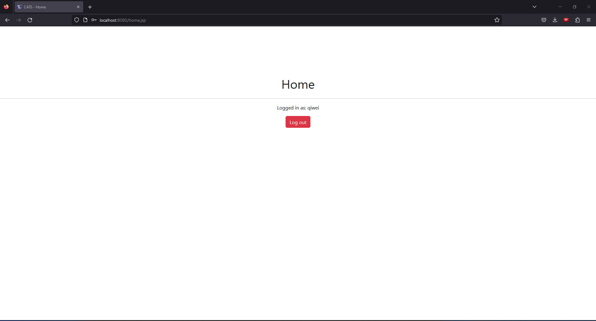

# Introduction
This is just a simple application that I came up with after trying to learn some basic Java Web Development using Java Enterprise Edition.

# Specifications
The technologies used to develop this are:

1. IDE - Intellij IDE (with J2EE)
2. JDK Version -  jdk1.8.0_351
3. J2EE Server Implementation - Payara Microserver 5 (Based off Glassfish)
4. Database - Microsoft SQL Server & Microsoft SQL Server Management Studio

# Credits
Navin Reddy's Course: https://www.youtube.com/watch?v=OuBUUkQfBYM

# Preview Snapshots
## Index Page

## About Page

## Login Page

## Home Page

